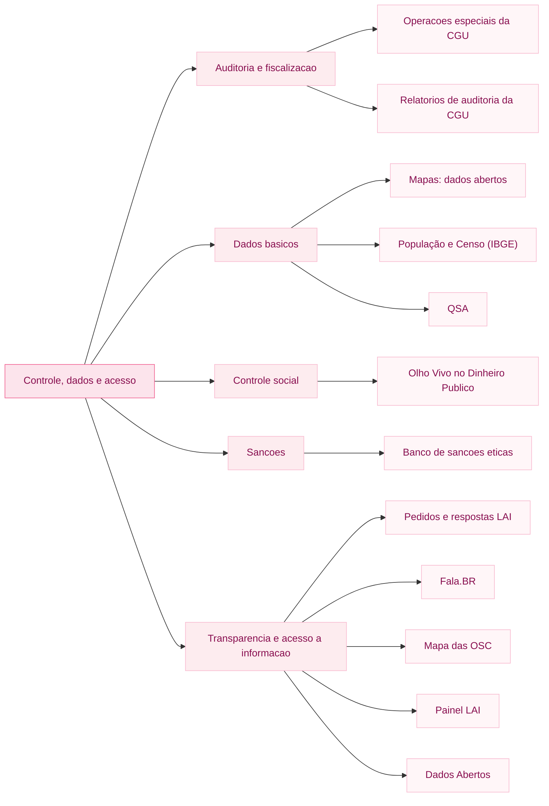

# Controle, Dados e Acesso

Recorte temático da rede para auditoria, dados básicos, controle social,
sanções e mecanismos de transparência ativa e passiva.

## Diagrama

```mermaid
flowchart LR
    classDef macro fill:#FCE4EC,stroke:#F06292,color:#880E4F;
    classDef area fill:#FDECEF,stroke:#F8BBD0,color:#880E4F;
    classDef leaf fill:#FFF6F8,stroke:#F8BBD0,color:#880E4F;

    M["Controle, dados e acesso"]:::macro

    AUD["Auditoria e fiscalizacao"]:::area
    DAD["Dados basicos"]:::area
    CS["Controle social"]:::area
    SAN["Sancoes"]:::area
    TAI["Transparencia e acesso a informacao"]:::area

    M --> AUD
    M --> DAD
    M --> CS
    M --> SAN
    M --> TAI

    AUD --> A1["Operacoes especiais da CGU"]:::leaf
    AUD --> A2["Relatorios de auditoria da CGU"]:::leaf

    DAD --> D1["Mapas: dados abertos"]:::leaf
    DAD --> D2["População e Censo (IBGE)"]:::leaf
    DAD --> D3["QSA"]:::leaf

    CS --> C1["Olho Vivo no Dinheiro Publico"]:::leaf

    SAN --> S1["Banco de sancoes eticas"]:::leaf

    TAI --> T1["Pedidos e respostas LAI"]:::leaf
    TAI --> T2["Fala.BR"]:::leaf
    TAI --> T3["Mapa das OSC"]:::leaf
    TAI --> T4["Painel LAI"]:::leaf
    TAI --> T5["Dados Abertos"]:::leaf
```
