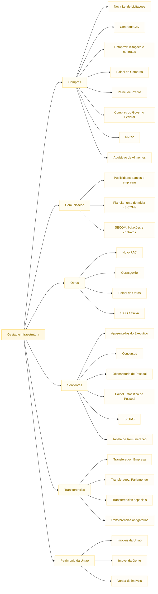

# Gestão e Infraestrutura

Recorte temático da rede para compras, obras, servidores, transferências e
ativos patrimoniais.

## Diagrama

```mermaid
flowchart LR
    classDef macro fill:#FFF8E1,stroke:#FFD54F,color:#8D6E00;
    classDef area fill:#FFFDF2,stroke:#FFE082,color:#8D6E00;
    classDef leaf fill:#FFFDF7,stroke:#FFECB3,color:#8D6E00;

    M["Gestao e infraestrutura"]:::macro

    COMP["Compras"]:::area
    COMU["Comunicacao"]:::area
    OBR["Obras"]:::area
    SERV["Servidores"]:::area
    TRANS["Transferencias"]:::area
    PAT["Patrimonio da Uniao"]:::area

    M --> COMP
    M --> COMU
    M --> OBR
    M --> SERV
    M --> TRANS
    M --> PAT

    COMP --> C1["Nova Lei de Licitacoes"]:::leaf
    COMP --> C2["ContratosGov"]:::leaf
    COMP --> C3["Dataprev: licitações e contratos"]:::leaf
    COMP --> C4["Painel de Compras"]:::leaf
    COMP --> C5["Painel de Precos"]:::leaf
    COMP --> C6["Compras do Governo Federal"]:::leaf
    COMP --> C7["PNCP"]:::leaf
    COMP --> C8["Aquisicao de Alimentos"]:::leaf

    COMU --> CM1["Publicidade: bancos e empresas"]:::leaf
    COMU --> CM2["Planejamento de mídia (SICOM)"]:::leaf
    COMU --> CM3["SECOM: licitações e contratos"]:::leaf

    OBR --> O1["Novo PAC"]:::leaf
    OBR --> O2["Obrasgov.br"]:::leaf
    OBR --> O3["Painel de Obras"]:::leaf
    OBR --> O4["SIOBR Caixa"]:::leaf

    SERV --> S1["Aposentados do Executivo"]:::leaf
    SERV --> S2["Concursos"]:::leaf
    SERV --> S3["Observatorio de Pessoal"]:::leaf
    SERV --> S4["Painel Estatistico de Pessoal"]:::leaf
    SERV --> S5["SIORG"]:::leaf
    SERV --> S6["Tabela de Remuneracao"]:::leaf

    TRANS --> T1["Transferegov: Empresa"]:::leaf
    TRANS --> T2["Transferegov: Parlamentar"]:::leaf
    TRANS --> T3["Transferencias especiais"]:::leaf
    TRANS --> T4["Transferencias obrigatorias"]:::leaf

    PAT --> P1["Imoveis da Uniao"]:::leaf
    PAT --> P2["Imovel da Gente"]:::leaf
    PAT --> P3["Venda de imoveis"]:::leaf
```
