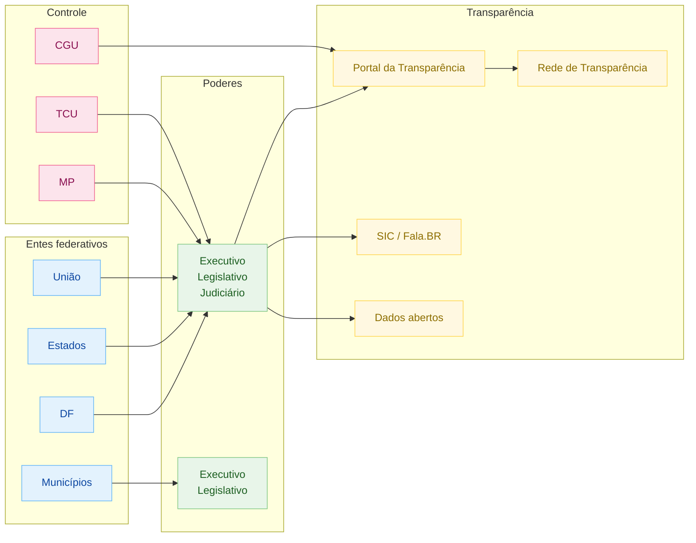

# Estrutura de Governança

Visão de alto nível da relação entre entes federativos, poderes, mecanismos
de transparência e órgãos de controle.

## Diagrama

```mermaid
flowchart LR
    classDef ente fill:#E3F2FD,stroke:#64B5F6,color:#0D47A1;
    classDef poder fill:#E8F5E9,stroke:#81C784,color:#1B5E20;
    classDef transp fill:#FFF8E1,stroke:#FFD54F,color:#8D6E00;
    classDef controle fill:#FCE4EC,stroke:#F06292,color:#880E4F;

    subgraph F["Entes federativos"]
        direction TB
        U["União"]
        E["Estados"]
        DF["DF"]
        M["Municípios"]
    end

    subgraph P["Poderes"]
        direction TB
        P3["Executivo<br/>Legislativo<br/>Judiciário"]
        P2["Executivo<br/>Legislativo"]
    end

    subgraph T["Transparência"]
        direction TB
        PT["Portal da Transparência"]
        SIC["SIC / Fala.BR"]
        DA["Dados abertos"]
        RL["Rede de Transparência"]
    end

    subgraph C["Controle"]
        direction TB
        CGU["CGU"]
        TCU["TCU"]
        MP["MP"]
    end

    U --> P3
    E --> P3
    DF --> P3
    M --> P2

    P3 --> PT
    P3 --> SIC
    P3 --> DA

    PT --> RL
    CGU --> PT
    TCU --> P3
    MP --> P3

    class U,E,DF,M ente;
    class P3,P2 poder;
    class PT,SIC,DA,RL transp;
    class CGU,TCU,MP controle;
```
