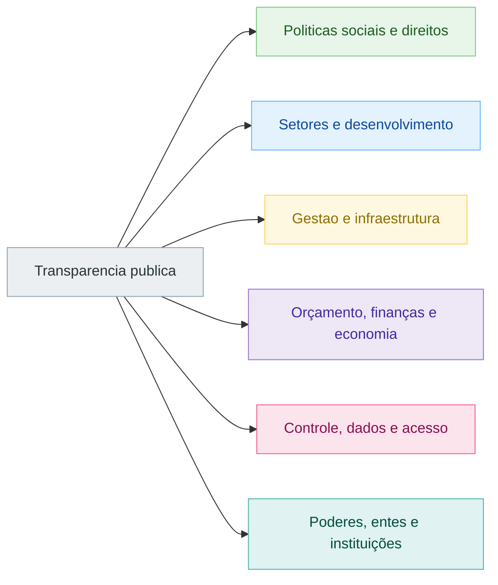

# Macro Setores da Rede de Transparencia

Visão agregada da taxonomia principal da rede. Use este arquivo para
entender a organização geral e os arquivos temáticos para manutenção local.

## Arquivos relacionados

- [03-politicas-sociais-e-direitos.md](./03-politicas-sociais-e-direitos.md)
- [04-setores-e-desenvolvimento.md](./04-setores-e-desenvolvimento.md)
- [05-gestao-e-infraestrutura.md](./05-gestao-e-infraestrutura.md)
- [06-orcamento-financas-e-economia.md](./06-orcamento-financas-e-economia.md)
- [07-controle-dados-e-acesso.md](./07-controle-dados-e-acesso.md)
- [08-poderes-entes-e-instituicoes.md](./08-poderes-entes-e-instituicoes.md)

## Diagrama

