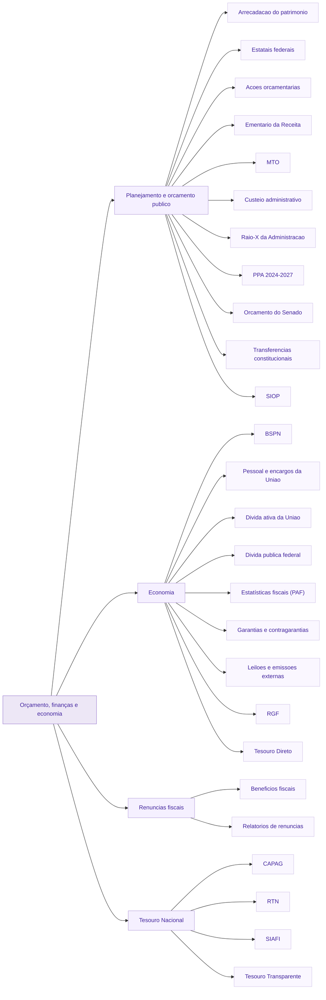

# Orçamento, Finanças e Economia

Recorte temático da rede para planejamento publico, finanças, renuncias e
instrumentos do Tesouro Nacional.

## Diagrama

```mermaid
flowchart LR
    classDef macro fill:#EDE7F6,stroke:#9575CD,color:#4527A0;
    classDef area fill:#F5F0FF,stroke:#B39DDB,color:#4527A0;
    classDef leaf fill:#FAF7FF,stroke:#D1C4E9,color:#4527A0;

    M["Orçamento, finanças e economia"]:::macro

    POP["Planejamento e orcamento publico"]:::area
    ECO["Economia"]:::area
    REN["Renuncias fiscais"]:::area
    TES["Tesouro Nacional"]:::area

    M --> POP
    M --> ECO
    M --> REN
    M --> TES

    POP --> P1["Arrecadacao do patrimonio"]:::leaf
    POP --> P2["Estatais federais"]:::leaf
    POP --> P3["Acoes orcamentarias"]:::leaf
    POP --> P4["Ementario da Receita"]:::leaf
    POP --> P5["MTO"]:::leaf
    POP --> P6["Custeio administrativo"]:::leaf
    POP --> P7["Raio-X da Administracao"]:::leaf
    POP --> P8["PPA 2024-2027"]:::leaf
    POP --> P9["Orcamento do Senado"]:::leaf
    POP --> P10["Transferencias constitucionais"]:::leaf
    POP --> P11["SIOP"]:::leaf

    ECO --> E1["BSPN"]:::leaf
    ECO --> E2["Pessoal e encargos da Uniao"]:::leaf
    ECO --> E3["Divida ativa da Uniao"]:::leaf
    ECO --> E4["Divida publica federal"]:::leaf
    ECO --> E5["Estatísticas fiscais (PAF)"]:::leaf
    ECO --> E6["Garantias e contragarantias"]:::leaf
    ECO --> E7["Leiloes e emissoes externas"]:::leaf
    ECO --> E8["RGF"]:::leaf
    ECO --> E9["Tesouro Direto"]:::leaf

    REN --> R1["Beneficios fiscais"]:::leaf
    REN --> R2["Relatorios de renuncias"]:::leaf

    TES --> T1["CAPAG"]:::leaf
    TES --> T2["RTN"]:::leaf
    TES --> T3["SIAFI"]:::leaf
    TES --> T4["Tesouro Transparente"]:::leaf
```
