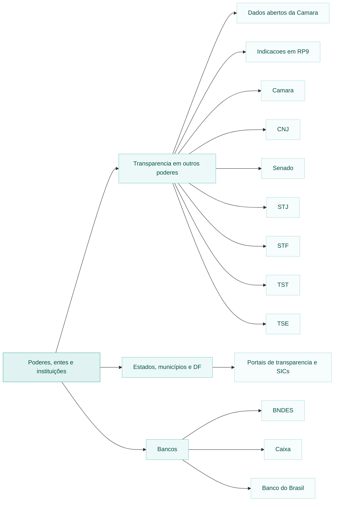

# Poderes, Entes e Instituições

Recorte temático da rede para outros poderes, entes subnacionais e
instituições financeiras relevantes para transparência publica.

## Diagrama

```mermaid
flowchart LR
    classDef macro fill:#E0F2F1,stroke:#4DB6AC,color:#004D40;
    classDef area fill:#EDF9F8,stroke:#80CBC4,color:#004D40;
    classDef leaf fill:#F7FCFC,stroke:#B2DFDB,color:#004D40;

    M["Poderes, entes e instituições"]:::macro

    POD["Transparencia em outros poderes"]:::area
    ENT["Estados, municípios e DF"]:::area
    BAN["Bancos"]:::area

    M --> POD
    M --> ENT
    M --> BAN

    POD --> P1["Dados abertos da Camara"]:::leaf
    POD --> P2["Indicacoes em RP9"]:::leaf
    POD --> P3["Camara"]:::leaf
    POD --> P4["CNJ"]:::leaf
    POD --> P5["Senado"]:::leaf
    POD --> P6["STJ"]:::leaf
    POD --> P7["STF"]:::leaf
    POD --> P8["TST"]:::leaf
    POD --> P9["TSE"]:::leaf

    ENT --> E1["Portais de transparencia e SICs"]:::leaf

    BAN --> B1["BNDES"]:::leaf
    BAN --> B2["Caixa"]:::leaf
    BAN --> B3["Banco do Brasil"]:::leaf
```
