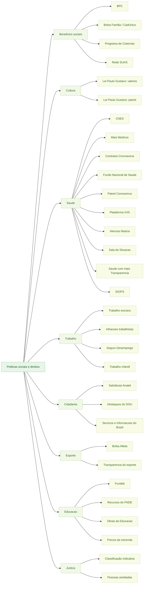

# Politicas Sociais e Direitos

Recorte temático da rede para benefícios, serviços públicos e politicas
voltadas a direitos sociais.

## Diagrama

```mermaid
flowchart LR
    classDef macro fill:#E8F5E9,stroke:#81C784,color:#1B5E20;
    classDef area fill:#F1F8E9,stroke:#AED581,color:#33691E;
    classDef leaf fill:#F9FBE7,stroke:#C5E1A5,color:#33691E;

    M["Politicas sociais e direitos"]:::macro

    BEN["Beneficios sociais"]:::area
    CUL["Cultura"]:::area
    SAU["Saude"]:::area
    TRA["Trabalho"]:::area
    CID["Cidadania"]:::area
    ESP["Esporte"]:::area
    EDU["Educacao"]:::area
    JUS["Justica"]:::area

    M --> BEN
    M --> CUL
    M --> SAU
    M --> TRA
    M --> CID
    M --> ESP
    M --> EDU
    M --> JUS

    BEN --> B1["BPC"]:::leaf
    BEN --> B2["Bolsa Familia / CadUnico"]:::leaf
    BEN --> B3["Programa de Cisternas"]:::leaf
    BEN --> B4["Rede SUAS"]:::leaf

    CUL --> C1["Lei Paulo Gustavo: valores"]:::leaf
    CUL --> C2["Lei Paulo Gustavo: painel"]:::leaf

    SAU --> S1["CNES"]:::leaf
    SAU --> S2["Mais Medicos"]:::leaf
    SAU --> S3["Contratos Coronavirus"]:::leaf
    SAU --> S4["Fundo Nacional de Saude"]:::leaf
    SAU --> S5["Painel Coronavirus"]:::leaf
    SAU --> S6["Plataforma IVIS"]:::leaf
    SAU --> S7["Atencao Basica"]:::leaf
    SAU --> S8["Sala de Situacao"]:::leaf
    SAU --> S9["Saude com mais Transparencia"]:::leaf
    SAU --> S10["SIOPS"]:::leaf

    TRA --> T1["Trabalho escravo"]:::leaf
    TRA --> T2["Infracoes trabalhistas"]:::leaf
    TRA --> T3["Seguro Desemprego"]:::leaf
    TRA --> T4["Trabalho infantil"]:::leaf

    CID --> CI1["Satisfacao Anatel"]:::leaf
    CID --> CI2["Destaques do DOU"]:::leaf
    CID --> CI3["Servicos e Informacoes do Brasil"]:::leaf

    ESP --> E1["Bolsa Atleta"]:::leaf
    ESP --> E2["Transparencia do esporte"]:::leaf

    EDU --> ED1["Fundeb"]:::leaf
    EDU --> ED2["Recursos do FNDE"]:::leaf
    EDU --> ED3["Obras da Educacao"]:::leaf
    EDU --> ED4["Precos da merenda"]:::leaf

    JUS --> J1["Classificação indicativa"]:::leaf
    JUS --> J2["Pessoas anistiadas"]:::leaf
```
