# Rede de Transparência Completa

Visão consolidada de toda a rede. Devida a complexidade da rede o que dificulta a visualização e entendimento é possível consultar de forma mais segmentada.

## Diagrama

```mermaid
flowchart LR
    classDef root fill:#ECEFF1,stroke:#90A4AE,color:#263238;
    classDef soc fill:#E8F5E9,stroke:#81C784,color:#1B5E20;
    classDef socL fill:#F1F8E9,stroke:#AED581,color:#33691E;
    classDef set fill:#E3F2FD,stroke:#64B5F6,color:#0D47A1;
    classDef setL fill:#EAF4FF,stroke:#90CAF9,color:#0D47A1;
    classDef ges fill:#FFF8E1,stroke:#FFD54F,color:#8D6E00;
    classDef gesL fill:#FFFDF2,stroke:#FFE082,color:#8D6E00;
    classDef eco fill:#EDE7F6,stroke:#9575CD,color:#4527A0;
    classDef ecoL fill:#F5F0FF,stroke:#B39DDB,color:#4527A0;
    classDef con fill:#FCE4EC,stroke:#F06292,color:#880E4F;
    classDef conL fill:#FDECEF,stroke:#F8BBD0,color:#880E4F;
    classDef inst fill:#E0F2F1,stroke:#4DB6AC,color:#004D40;
    classDef instL fill:#EDF9F8,stroke:#80CBC4,color:#004D40;

    R["Transparencia publica"]:::root

    subgraph SG["Politicas sociais e direitos"]
        direction TB
        MSOC["Politicas sociais e direitos"]:::soc

        BEN["Beneficios sociais"]:::soc
        CUL["Cultura"]:::soc
        SAU["Saude"]:::soc
        TRA["Trabalho"]:::soc
        CIDA["Cidadania"]:::soc
        ESP["Esporte"]:::soc
        EDU["Educacao"]:::soc
        JUS["Justica"]:::soc

        BEN --> BPC["BPC"]:::socL
        BEN --> BFA["Bolsa Familia / CadUnico"]:::socL
        BEN --> CIS["Programa de Cisternas"]:::socL
        BEN --> SUAS["Rede SUAS"]:::socL

        CUL --> LPGV["Lei Paulo Gustavo: valores"]:::socL
        CUL --> LPGP["Lei Paulo Gustavo: painel"]:::socL

        SAU --> CNES["CNES"]:::socL
        SAU --> MMED["Mais Medicos"]:::socL
        SAU --> CCOV["Contratos Coronavirus"]:::socL
        SAU --> FNS["Fundo Nacional de Saude"]:::socL
        SAU --> PCOV["Painel Coronavirus"]:::socL
        SAU --> IVIS["Plataforma IVIS"]:::socL
        SAU --> RAB["Atencao Basica"]:::socL
        SAU --> SSAU["Sala de Situacao em Saude"]:::socL
        SAU --> SMT["Saude com mais Transparencia"]:::socL
        SAU --> SIOPS["SIOPS"]:::socL

        TRA --> TESC["Trabalho escravo"]:::socL
        TRA --> INFT["Infracoes trabalhistas"]:::socL
        TRA --> SDES["Seguro Desemprego"]:::socL
        TRA --> TINF["Trabalho infantil"]:::socL

        CIDA --> ANAT["Satisfacao Anatel"]:::socL
        CIDA --> DOU["Destaques do DOU"]:::socL
        CIDA --> SERV["Servicos e Informacoes do Brasil"]:::socL

        ESP --> BAT["Bolsa Atleta"]:::socL
        ESP --> TIESP["Transparencia do esporte"]:::socL

        EDU --> FUNDEB["Fundeb"]:::socL
        EDU --> FNDE["Liberação de recursos (FNDE)"]:::socL
        EDU --> OEDU["Obras da Educacao"]:::socL
        EDU --> MER["Precos da merenda escolar"]:::socL

        JUS --> CI["Classificacao indicativa"]:::socL
        JUS --> ANIST["Pessoas anistiadas"]:::socL
    end

    subgraph SETG["Setores e desenvolvimento"]
        direction TB
        MSET["Setores e desenvolvimento"]:::set

        AGR["Agricultura, pecuária e abastecimento"]:::set
        URB["Desenvolvimento urbano"]:::set
        ENE["Energia"]:::set
        MMA["Meio ambiente"]:::set
        TUR["Turismo"]:::set
        CTEC["Ciencia e tecnologia"]:::set
        DEF["Defesa"]:::set

        AGR --> CNPO["Produtores orgânicos (CNPO)"]:::setL
        AGR --> CONAB["Estoques públicos (Conab)"]:::setL
        AGR --> PAP["Plano Agricola e Pecuario"]:::setL
        AGR --> SIPE["SIPEAGRO"]:::setL
        AGR --> PESQ["Atividade pesqueira"]:::setL

        URB --> MCMV["Minha Casa Minha Vida"]:::setL
        URB --> CAP["Portal Capacidades"]:::setL
        URB --> SINAPI["SINAPI"]:::setL

        ENE --> PETR["Petrobras: licitações e contratos"]:::setL
        ENE --> RHID["Royalties hidricos"]:::setL
        ENE --> RPET["Royalties do petroleo"]:::setL

        MMA --> BVER["Bolsa Verde"]:::setL
        MMA --> PREM["PREs do MMA"]:::setL

        TUR --> AEV["Agenda de Eventos"]:::setL
        TUR --> CAD["Cadastur"]:::setL

        CTEC --> CNPQ["CNPq: bolsas e valores"]:::setL
        CTEC --> ICT["Indicadores nacionais de C&T"]:::setL

        DEF --> FAB["Voos da FAB"]:::setL
    end

    subgraph GEG["Gestão e infraestrutura"]
        direction TB
        MGES["Gestao e infraestrutura"]:::ges

        COMP["Compras"]:::ges
        COMU["Comunicacao"]:::ges
        OBR["Obras"]:::ges
        SERVP["Servidores"]:::ges
        TRANSF["Transferencias"]:::ges
        PAT["Patrimonio da Uniao"]:::ges

        COMP --> NLL["Nova Lei de Licitacoes"]:::gesL
        COMP --> CGOV["ContratosGov"]:::gesL
        COMP --> DTL["Dataprev: licitações e contratos"]:::gesL
        COMP --> PCOM["Painel de Compras"]:::gesL
        COMP --> PPRE["Painel de Precos"]:::gesL
        COMP --> CGF["Compras do Governo Federal"]:::gesL
        COMP --> PNCP["PNCP"]:::gesL
        COMP --> PAA["Aquisicao de Alimentos"]:::gesL

        COMU --> IPUB["Publicidade: bancos e empresas"]:::gesL
        COMU --> SICOM["Planejamento de mídia (SICOM)"]:::gesL
        COMU --> SECOM["SECOM: licitações e contratos"]:::gesL

        OBR --> PAC["Novo PAC"]:::gesL
        OBR --> OBG["Obrasgov.br"]:::gesL
        OBR --> POBR["Painel de Obras"]:::gesL
        OBR --> SIOBR["SIOBR Caixa"]:::gesL

        SERVP --> APSI["Aposentados do Executivo"]:::gesL
        SERVP --> CONC["Concursos"]:::gesL
        SERVP --> OPES["Observatorio de Pessoal"]:::gesL
        SERVP --> PEP["Painel Estatistico de Pessoal"]:::gesL
        SERVP --> SIORG["SIORG"]:::gesL
        SERVP --> TREM["Tabela de Remuneracao"]:::gesL

        TRANSF --> TGE["Transferegov: Empresa"]:::gesL
        TRANSF --> TGP["Transferegov: Parlamentar"]:::gesL
        TRANSF --> TESP["Transferencias especiais"]:::gesL
        TRANSF --> TOBR["Transferencias obrigatorias"]:::gesL

        PAT --> SPU["Imoveis da Uniao"]:::gesL
        PAT --> IMOG["Imovel da Gente"]:::gesL
        PAT --> VIM["Venda de imoveis"]:::gesL
    end

    subgraph ECOG["Orçamento, finanças e economia"]
        direction TB
        MECO["Orçamento, finanças e economia"]:::eco

        POP["Planejamento e orcamento publico"]:::eco
        ECO["Economia"]:::eco
        REN["Renuncias fiscais"]:::eco
        TES["Tesouro Nacional"]:::eco

        POP --> ARPP["Arrecadacao do patrimonio"]:::ecoL
        POP --> ESTAT["Estatais federais"]:::ecoL
        POP --> ACO["Acoes orcamentarias"]:::ecoL
        POP --> EREC["Ementario da Receita"]:::ecoL
        POP --> MTO["MTO"]:::ecoL
        POP --> PCUST["Custeio administrativo"]:::ecoL
        POP --> RXADM["Raio-X da Administracao"]:::ecoL
        POP --> PPA["PPA 2024-2027"]:::ecoL
        POP --> ORCS["Orcamento do Senado"]:::ecoL
        POP --> RTC["Transferencias constitucionais"]:::ecoL
        POP --> SIOP["SIOP"]:::ecoL

        ECO --> BSPN["BSPN"]:::ecoL
        ECO --> DPEU["Pessoal e encargos da Uniao"]:::ecoL
        ECO --> DAU["Divida ativa da Uniao"]:::ecoL
        ECO --> DPF["Divida publica federal"]:::ecoL
        ECO --> PAF["Estatísticas fiscais (PAF)"]:::ecoL
        ECO --> GAR["Garantias e contragarantias"]:::ecoL
        ECO --> LEIL["Leiloes e emissoes externas"]:::ecoL
        ECO --> RGF["RGF"]:::ecoL
        ECO --> TDIR["Tesouro Direto"]:::ecoL

        REN --> BFISC["Beneficios fiscais"]:::ecoL
        REN --> RREN["Relatorios de renuncias"]:::ecoL

        TES --> CAPAG["CAPAG"]:::ecoL
        TES --> RTN["RTN"]:::ecoL
        TES --> SIAFI["SIAFI"]:::ecoL
        TES --> TTRAN["Tesouro Transparente"]:::ecoL
    end

    subgraph COG["Controle, dados e acesso"]
        direction TB
        MCON["Controle, dados e acesso"]:::con

        AUD["Auditoria e fiscalizacao"]:::con
        DADOS["Dados basicos"]:::con
        CSOC["Controle social"]:::con
        SANC["Sancoes"]:::con
        TAI["Transparencia e acesso a informacao"]:::con

        AUD --> OECGU["Operacoes especiais da CGU"]:::conL
        AUD --> RACGU["Relatorios de auditoria da CGU"]:::conL

        DADOS --> MAPA["Mapas: dados abertos"]:::conL
        DADOS --> IBGE["População e Censo (IBGE)"]:::conL
        DADOS --> QSA["QSA"]:::conL

        CSOC --> OLHO["Olho Vivo no Dinheiro Publico"]:::conL

        SANC --> BSE["Banco de sancoes eticas"]:::conL

        TAI --> LAI["Pedidos e respostas LAI"]:::conL
        TAI --> FALA["Fala.BR"]:::conL
        TAI --> MOSC["Mapa das OSC"]:::conL
        TAI --> PLAI["Painel LAI"]:::conL
        TAI --> DAB["Dados Abertos"]:::conL
    end

    subgraph ING["Poderes, entes e instituições"]
        direction TB
        MINST["Poderes, entes e instituições"]:::inst

        OPOD["Transparencia em outros poderes"]:::inst
        ENTES["Estados, municípios e DF"]:::inst
        BANC["Bancos"]:::inst

        OPOD --> DACAM["Dados abertos da Camara"]:::instL
        OPOD --> RP9["Indicacoes em RP9"]:::instL
        OPOD --> TCAM["Camara"]:::instL
        OPOD --> CNJ["CNJ"]:::instL
        OPOD --> SEN["Senado"]:::instL
        OPOD --> STJ["STJ"]:::instL
        OPOD --> STF["STF"]:::instL
        OPOD --> TST["TST"]:::instL
        OPOD --> TSE["TSE"]:::instL

        ENTES --> PSIC["Portais de transparencia e SICs"]:::instL

        BANC --> BNDES["BNDES"]:::instL
        BANC --> CAIXA["Caixa"]:::instL
        BANC --> BB["Banco do Brasil"]:::instL
    end

    R --> MSOC
    R --> MSET
    R --> MGES
    R --> MECO
    R --> MCON
    R --> MINST

    MSOC --> BEN
    MSOC --> CUL
    MSOC --> SAU
    MSOC --> TRA
    MSOC --> CIDA
    MSOC --> ESP
    MSOC --> EDU
    MSOC --> JUS

    MSET --> AGR
    MSET --> URB
    MSET --> ENE
    MSET --> MMA
    MSET --> TUR
    MSET --> CTEC
    MSET --> DEF

    MGES --> COMP
    MGES --> COMU
    MGES --> OBR
    MGES --> SERVP
    MGES --> TRANSF
    MGES --> PAT

    MECO --> POP
    MECO --> ECO
    MECO --> REN
    MECO --> TES

    MCON --> AUD
    MCON --> DADOS
    MCON --> CSOC
    MCON --> SANC
    MCON --> TAI

    MINST --> OPOD
    MINST --> ENTES
    MINST --> BANC
```

