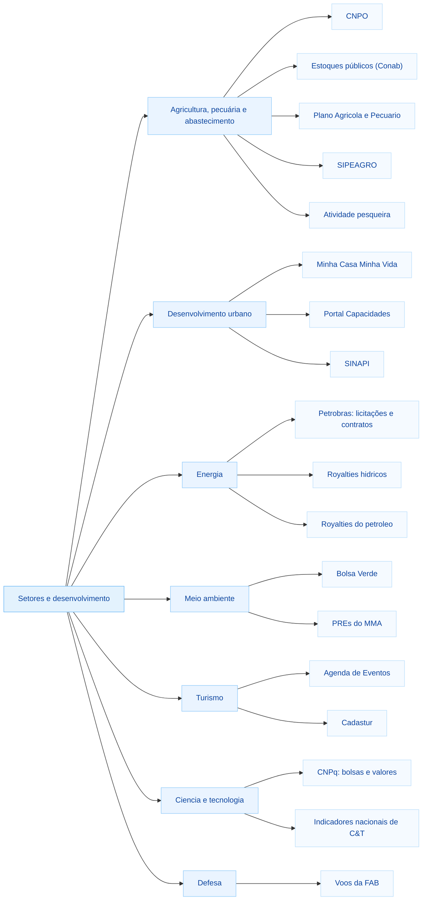

# Setores e Desenvolvimento

Recorte temático da rede para setores produtivos, infraestrutura setorial e
politicas de desenvolvimento.

## Diagrama

```mermaid
flowchart LR
    classDef macro fill:#E3F2FD,stroke:#64B5F6,color:#0D47A1;
    classDef area fill:#EAF4FF,stroke:#90CAF9,color:#0D47A1;
    classDef leaf fill:#F5FAFF,stroke:#BBDEFB,color:#0D47A1;

    M["Setores e desenvolvimento"]:::macro

    AGR["Agricultura, pecuária e abastecimento"]:::area
    URB["Desenvolvimento urbano"]:::area
    ENE["Energia"]:::area
    MMA["Meio ambiente"]:::area
    TUR["Turismo"]:::area
    CTEC["Ciencia e tecnologia"]:::area
    DEF["Defesa"]:::area

    M --> AGR
    M --> URB
    M --> ENE
    M --> MMA
    M --> TUR
    M --> CTEC
    M --> DEF

    AGR --> A1["CNPO"]:::leaf
    AGR --> A2["Estoques públicos (Conab)"]:::leaf
    AGR --> A3["Plano Agricola e Pecuario"]:::leaf
    AGR --> A4["SIPEAGRO"]:::leaf
    AGR --> A5["Atividade pesqueira"]:::leaf

    URB --> U1["Minha Casa Minha Vida"]:::leaf
    URB --> U2["Portal Capacidades"]:::leaf
    URB --> U3["SINAPI"]:::leaf

    ENE --> EN1["Petrobras: licitações e contratos"]:::leaf
    ENE --> EN2["Royalties hidricos"]:::leaf
    ENE --> EN3["Royalties do petroleo"]:::leaf

    MMA --> M1["Bolsa Verde"]:::leaf
    MMA --> M2["PREs do MMA"]:::leaf

    TUR --> T1["Agenda de Eventos"]:::leaf
    TUR --> T2["Cadastur"]:::leaf

    CTEC --> C1["CNPq: bolsas e valores"]:::leaf
    CTEC --> C2["Indicadores nacionais de C&T"]:::leaf

    DEF --> D1["Voos da FAB"]:::leaf
```
